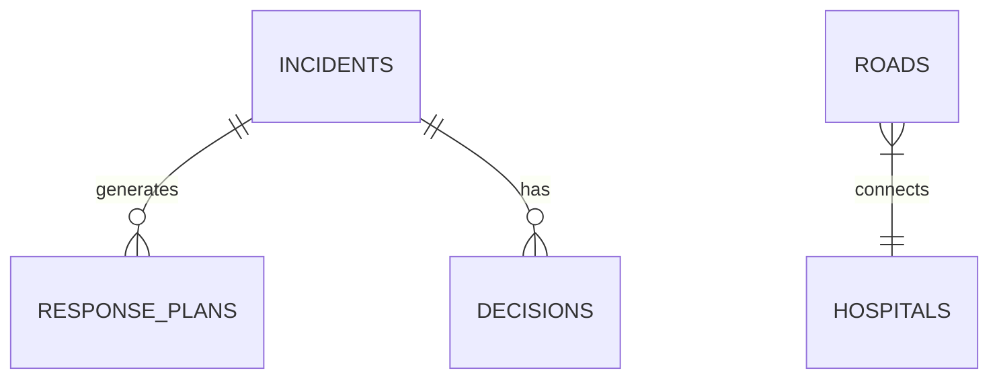

# Database Documentation

## Tables

### `incidents`
Stores emergency incidents reported to the system.
- `id` (UUID): Primary Key
- `title` (VARCHAR): Short title
- `description` (TEXT): Detailed description
- `severity` (ENUM): low, medium, high, critical
- `priority` (ENUM): low, medium, high, critical
- `status` (ENUM): active, resolved, pending
- `created_at`, `updated_at` (TIMESTAMP)

### `resources`
Generic resources available for dispatch.
- `id` (UUID): Primary Key
- `name` (VARCHAR): Resource name
- `type` (VARCHAR): e.g., Medical Equipment, Fire Safety
- `status` (ENUM): available, deployed, maintenance
- `created_at`, `updated_at` (TIMESTAMP)

### `ambulances`
Medical transport units.
- `id` (UUID): Primary Key
- `name` (VARCHAR, UNIQUE): Identifier (e.g., A1)
- `status` (ENUM): available, maintenance, deployed
- `capacity` (INT): Patient capacity, constrained > 0
- `created_at`, `updated_at` (TIMESTAMP)

### `hospitals`
Medical facilities for drop-off.
- `id` (UUID): Primary Key
- `name` (VARCHAR, UNIQUE): Identifier (e.g., H1)
- `emergency_capacity` (INT): Beds available, constrained >= 0
- `created_at`, `updated_at` (TIMESTAMP)

### `roads`
Edges forming the transportation graph.
- `id` (UUID): Primary Key
- `source_node` (VARCHAR): Start point
- `target_node` (VARCHAR): End point
- `distance` (FLOAT): Distance in km
- `travel_time` (FLOAT): Baseline time
- `traffic_factor` (FLOAT): Multiplier >= 1
- `is_blocked` (BOOLEAN): True if impassable
- `risk_factor` (FLOAT): 0 to 1
- `created_at`, `updated_at` (TIMESTAMP)

### `response_plans`
Action sequences generated by the planning module.
- `id` (UUID): Primary Key
- `incident_id` (UUID): Foreign Key -> incidents
- `plan_details` (TEXT): Serialized plan steps
- `created_at`, `updated_at` (TIMESTAMP)

### `decisions`
Logs of LLM Agent decisions.
- `id` (UUID): Primary Key
- `incident_id` (UUID): Foreign Key -> incidents
- `decision_text` (TEXT): Decision rationale
- `created_at`, `updated_at` (TIMESTAMP)

### `inference_logs` / `search_logs`
Audit trails for AI execution.
- `id` (UUID): Primary Key
- `log_data` (TEXT): Output traces
- `search_type` (VARCHAR): (only in search_logs)
- `created_at`, `updated_at` (TIMESTAMP)

## Relationships
- `response_plans.incident_id` references `incidents.id`
- `decisions.incident_id` references `incidents.id`
- `roads.source_node` and `target_node` virtually map to `hospitals.name` or generic node names (N1, N2, etc.)

## Indexes
- `idx_incidents_status` on `incidents(status)`
- `idx_incidents_severity` on `incidents(severity)`
- `idx_ambulances_status` on `ambulances(status)`
- `idx_roads_source_target` on `roads(source_node, target_node)`

## Seed Data Description
The `seed.sql` file initializes the system with:
- 3 Ambulances (2 available, 1 maintenance)
- 2 Hospitals (capacities 20 and 8)
- A connected graph of 13 road edges linking Hospitals and intermediate nodes (N1-N8).
- Sample equipment (Defibrillator, Trauma Kit, Extinguisher).

## ER Diagram (Mermaid)

